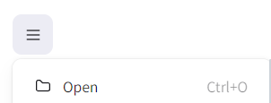

# ⛓️ Unidad 4: Estructuras de Datos

## 📚 Clase 5: Introducción a Estructuras de Datos, Lista Simplemente Enlazada y Lista Doblemente Enlazada

_Fecha: 07-06-2024_

En esta clase se abordaron los temas de estructuras de datos estáticas y dinámicas, lista simplemente enlazada y lista doblemente enlazada, las cuales son herramientas muy útiles para el manejo de datos y solución de problemas.

### 📖 Contenido:

- Estructuras de datos
- Tipos de estructuras de datos
    - Estructuras de datos estáticas
    - Estructuras de datos dinámicas
- Estructuras de datos dinámicas lineales
    - Lista simplemente enlazada
    - Lista doblemente enlazada

### 💻 Ejemplo de la Clase

Lo puedes encontrar en:  [Clase05/main.py](./Clase05/main.py)

### 🚀 Extra

Dentro de la carpeta de la clase encontrarás una carpeta llamada `Pizarron`, la cual tiene un archivo de [Excalidraw](https://excalidraw.com/), donde lo puedes descargar y cargarlo en la página oficial de Excalidraw para ver el pizarrón de la clase.

Para cargar el pizarrron en [Excalidraw](https://excalidraw.com/), sigue los siguientes pasos:

1. Ingresa a la página de Excalidraw: [https://excalidraw.com/](https://excalidraw.com/)

2. Ve al botón de lado izquierdo superior y luego a `Open`.

3. Cargas el archivo [Pizarron](./Clase05/Pizarron/EjemploClase05.excalidraw)

4. Listo, ya puedes ver el pizarrón de la clase y manipularlo a tu manera.

### 🎥 Grabación de la Clase

**Clase 5**: [https://drive.google.com/file/d/1oof6qIcLhIjIT7p3BFZXg0oZWJWz5C5Q/view?usp=sharing](https://drive.google.com/file/d/1oof6qIcLhIjIT7p3BFZXg0oZWJWz5C5Q/view?usp=sharing)

## 📚 Clase 6: Continuación a Estructuras de Datos, Lista Circular Simplemente Enlazada y Lista Circular Doblemente Enlazada

_Fecha: 10-06-2024_

En esta clase se abordaron los temas de listas circulares simplemente enlazadas y doblemente enlazadas.

### 📖 Contenido:

- Estructuras de datos dinámicas lineales circulares
    - Lista circular simplemente enlazada
    - Lista circular doblemente enlazada

### 💻 Ejemplo de la Clase

Lo puedes encontrar en:  [Clase06/main.py](./Clase06/main.py)

### 🎥 Grabación de la Clase

**Clase 6**: [https://drive.google.com/file/d/1IQRQsbdRZ3rGbRAtgZtvIOqk4krOAP_U/view?usp=sharing](https://drive.google.com/file/d/1IQRQsbdRZ3rGbRAtgZtvIOqk4krOAP_U/view?usp=sharing)